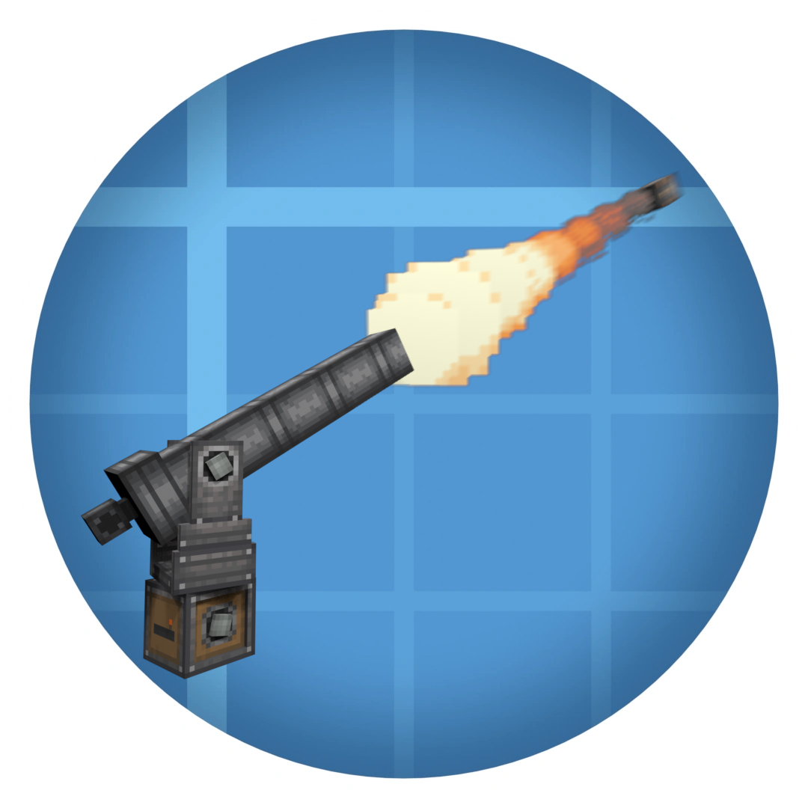

  
  <h1>Create Big Cannons: Going Ballistic</h1>

Create Big Cannons: Going Ballistic is a mod that significantly increases the speed of Create: Big Cannons projectiles, improving the range of cannons. Create: Big Cannon's ballistics model is inaccurate, the range of a cannon scaling linearly with the amount of powder charges loaded into it, and powder charges don't seem to push the projectiles as fast as they should. This mod changes that. It does so by changing the ballistics formula used for velocity calculation to the one [Benjamin Robins developed](https://www.arc.id.au/CannonBallistics.html) in 1742:

$$
\begin{flalign}
\textbf{Robins' Cannon Formula}\\
v=1991 \sqrt{ \frac{p}{m + \frac{1}{3} p} \ln{ \left(\frac{L}{c}\right) } }\\
\end{flalign}\\
$$
$$
\begin{align}
&m=\text{Mass of projectile (kg)}\\
&p=\text{Mass of powder (kg)}\\
&c=\text{Total length of powder charges in barrel (m)}\\
&L=\text{Barrel length (m)}
\end{align}
$$

This formula requires projectiles to have mass, so I estimated the weight of every projectile by assuming that the solid shot was entirely made of iron, calculating its volume, then basing the weight of the other projectiles off of the amount of iron items in their recipes. The machine gun round's mass looked similar to a 7.62x51mm / .308 round, just wider, so I took that round's IRL mass and increased it a bit.

I based the mass of gunpowder inside a powder charge off of what's visible on the block and assumed it was a solid column of gunpowder. When a Big Cartridge is full of gunpowder (4/4), it contains 4x more gunpowder than a regular powder charge, so I based the gunpowder mass off of the cartridge's power level. The autocannon's gunpowder mass was just assumed to be the volume of a filled autocannon cartridge:

| Shell | Shell Mass |
|-------|-----------|
|Solid Shot|3519.5 kg|
|AP Shot|3455.5 kg|
|Shrapnel Shell|3410.6 kg|
|AP Shell|3159.9 kg|
|HE Shell|2922.4 kg|
|Fluid Shell|2400.0 kg|
|Drop Mortar Shell|2255.5 kg|
|Mortar Stone|1162.3 kg|
|Smoke Shell|1037.0 kg|
|Grapeshot Shell|731.1 kg|
|Autocannon Shell (AP)|33.9 kg|
|Autocannon Shell (Flak)|32.1 kg|
|Machine Gun Bullet|0.012 kg|

| Propellant | Gunpowder Mass |
|-----------------|------|
|Big Cartridge (Power: 4/4)|252.0605 kg|
|Big Cartridge (Power: 3/4)|189.0454 kg|
|Big Cartridge (Power: 2/4)|126.0303 kg|
|Big Cartridge (Power: 1/4)|63.0151 kg|
|Powder Charge|63.0151 kg|
|Autocannon Cartridge|11.8153 kg|
|Machine Gun Cartridge|0.0035 kg|

## TODO:
- [x] Implement the base mod
- [ ] Add a ponder animation to the Powder Charge that shows how a cannon's size, amount of propellant, and shell type affects the projectile's trajectory with the new ballistics formula
